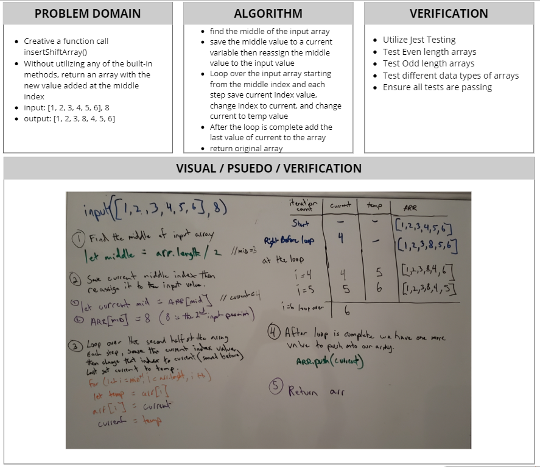

# Insert and Shift an Array
[Table of Contents](../../../README.md)

[Link to the Code](./array-shift.js)

## Challenge 02
Write a function called `insertShiftArray` which takes in an array and the value to be added. Without utilizing any of the built-in methods available to your language, return an array with the new value added at the middle index.

---

### Example:
| Input | Output |
| ----- | ------ |
| `[2,4,6,8], 5	` | `[2,4,5,6,8]` |
| `[4,8,15,23,42], 16` | `[4,8,15,16,23,42]` |

---

## Approach & Efficiency
For this challenge, I wanted to see if I was able to reduce the amount of iterations of looping. The solution I came up with executes the for loop for half of N, where N is the length of the initial array. The logic is, find the middle, save the middle value to a temp variable, and then loop over the array from middle index, changing the middle index value to the input value, and each index after to the temp value previously defined. This way reduces the amount of looping, and also does not create a whole new array. So big O(0.5n) for looping and O(1) space as we did not create a whole new array, just temp variables throughout the function.

---

## Solution

