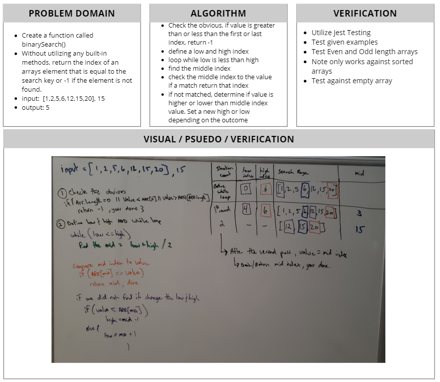

# Binary search in a sorted 1D array
[Table of Contents](../../../README.md)

[Link to the Code](./array-binary-search.js)

## Challenge 03
Write a function called `BinarySearch` which takes in 2 parameters: a sorted array and the search key. Without utilizing any of the built-in methods available to your language, return the index of the array’s element that is equal to the search key, or -1 if the element does not exist.

---

### Example:
| Input | Output |
| ----- | ------ |
| `[4,8,15,16,23,42], 15` | `2` |
| `[11,22,33,44,55,66,77], 90` | `-1` |

---

## Approach & Efficiency
The idea of a binary search is that each search interation, the size of the search is halfed. until the value is found. The first condition I check is if the array is empty or if the value is either below index 0 or higher than the last index, if this is true, we know the search value is not there so quickly return -1. After this check, we move into a while loop, this will continue to run until the value found or not. Inside we will check if the middle equals the search value, if so we found it! If not, lets adjust the low and high by the search value. For big O concerns, O(n) handles n numbers of the input array, but we only every handling half, then cutting that half in half, this is represented by O(log n). For space complexity we are O(1), as we are creating constant variables and nothing else.

---

## Solution

